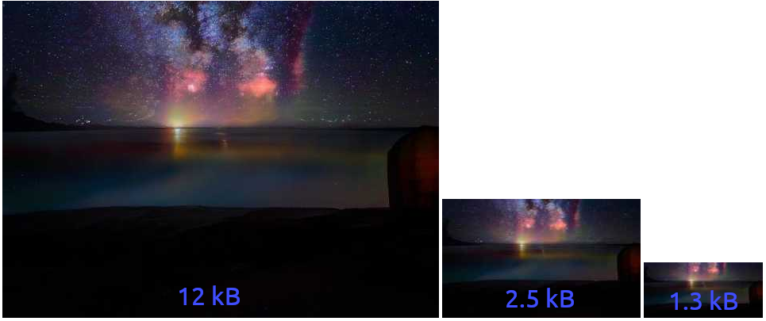

## Laravel S3 Thumbnail




🔥 **original photo was 1024x1024, 989.98 kB**
https://badgen.net/packagist/v/michaldoda/laravel-s3-thumbnail

By creating many media pages, I have worked out some solution. This package will help you to minimize S3 / Cloudfront costs (sometimes unexpected) and the amount of data transfer. It also helps SEO by optimizing the image size - yeah I tried that and Google Lighthouse likes that. 🎉

If your assets are not in terabytes, this package may be of help to you. Especially if you create small or medium-sized media sites.

You can configure your own thumbnails settings. Currently, the package supports resize, crop and quality. It is not much, but it is a good step for optimizing your website.

### Installation

```bash
# Install package
composer require michaldoda/laravel-s3-thumbnail

# Publish configuration
php artisan vendor:publish --tag=s3-thumbnail-config

# (Optional) if storage has not been linked
php artisan storage:link
```

### Usage

```php
# resources/article/some-view.blade.php
{{ $article->yourImageModel->getThumbnailHtml('article_main') }}

# it will produce

<picture data-alt="Description">
    <source srcset="/storage/thumbnails/pk.../bc9400.../w600.jpeg" media="(max-width: 600px)">
    
</picture>
```

```php
# app/Models/YourImageModel.php
use MichalDoda\LaravelS3Thumbnail\ThumbnailInterface;
use MichalDoda\LaravelS3Thumbnail\ThumbnailTrait;

class YourImageModel extends Model implements ThumbnailInterface
{
    use ThumbnailTrait;
    
    public function getS3ImagePath(): string
    {
        return $this->path;
    }

    public function getImageAltDescription(): ?string
    {
        return $this->alt;
    }
}
```

```php
# config/s3-thumbnail.php
'thumbnails' => [
   'article_main' => [
        [
            'max_width' => 'default',
            'quality' => 50,
            'filters' => [
                'resize' => [
                    'width'  => 550,
                ],
            ],
        ],
        [
            'max_width' => 600,
            'quality' => 50,
            'filters' => [
                'resize' => [
                    'width'  => 350,
                ],
            ],
        ],
        // ...
    ],
]
```

### Configuration
```php
/**
 * It is a default Laravel local disk name.
 * If you are using different disk for local purpose then please update the value.
 */
'local_disk' => 'local',
/**
 * It is a default Laravel s3 disk name.
 * If you are using different disk for s3 file system then please update the value.
 */
's3_disk' => 's3',
/**
 * It is a default Laravel public disk name.
 * If you are using different disk for public purpose then please update the value.
 */
'public_disk' => 'public',
/**
 * It will create directory ./storage/app/public/thumbnails.
 * There will be placed all thumbnails generated by the package.
 * If you already use one of the path below then please update the value.
 * ./storage/app/public/thumbnails
 * ./public/storage/thumbnails
 */
'public_path' => 'thumbnails',
/**
 * It will create directory ./storage/app/originals.
 * There will be placed all images retrieved from AWS S3 disk.
 * If you already use path ./storage/app/originals then please update the value.
 */
'originals_path' => 'originals',
/**
 * Default quality for thumbnails.
 * It will be used only if single thumbnail configuration does not have own value.
 */
'default_quality' => 80,
/**
 * Thumbnails configuration.
 */
'thumbnails' => [
    /**
     * Reduce image quality to 70% for all screens
     */
    'article_main' => [
        [
            'max_width' => 'default',
            'quality' => 70,
            'filters' => [],
        ]
    ],
    /**
     * Reduce image quality to 70% for screens viewport > 480px
     * Reduce image quality to 50% for screens viewport <= 480px
     */
    'article_main_another' => [
        [
            'max_width' => 'default',
            'quality' => 70,
            'filters' => [],
        ],
        [
            'max_width' => 480,
            'quality' => 50,
            'filters' => [],
        ],
    ],
    /**
     * Reduce image quality to 70% for all screens
     * Resize to width 550px
     */
    'article_suggestions1' => [
        [
            'max_width' => 'default',
            'quality' => 70,
            'filters' => [
                'resize' => [
                    'width'  => 550,
                ],
            ],
        ],
    ],
    /**
     * Reduce image quality to 70% for all screens
     * Resize to width 650
     * Crop 550x400
     */
    'article_suggestions2' => [
        [
            'max_width' => 'default',
            'quality' => 70,
            'filters' => [
                'resize' => [
                    'width'  => 650,
                ],
                'crop' => [
                    'width' => 550,
                    'height' => 400,
                ],
            ],
        ],
    ],
]
```

### Testing

```bash
composer test
```

### License

This package is open-sourced software licensed under the [MIT License](LICENSE).